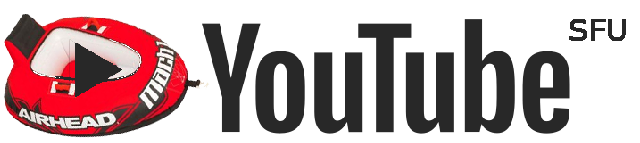

  

  <strong>🆠Future SFU Mountain Madness 2022 Winner ğŸ†</strong> 
  <em>Team:  <s>Legacy</s> Ambiguitiy Edition</em> 
  <a href="https://youtube-livid.vercel.app/" target="_blank">Click now to see tubes!</a>

---

Our project is a parody of YouTube as a play on the theme of ambiguity. For tubes and tubes only. The website shows a randomly selected tubing video from curated videos of different “tubes” including snow tubing, water tubing, tube tops, nanotubes, and more!

Built using blood, sweat, and memes, YouTube(tm) is your on stop shop for all tubing videos.

Built on [Next.js](https://nextjs.org/) (a React framework) and the YouTube API.

### Deployment

---

You can run it in 3 very easy steps:

1.  clone the repo
2.  cd into the repo /frontend
3.  npm install & npm run dev
